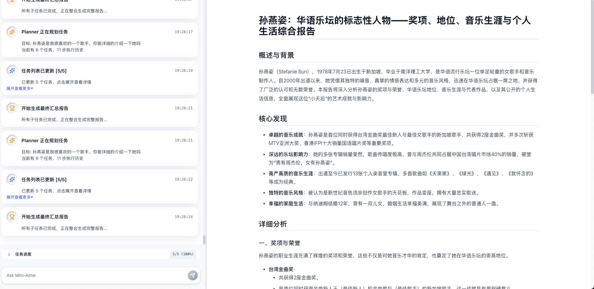

# Mini-Aime



A Minimal Viable Product (MVP) implementation of the [Aime multi-agent framework](https://arxiv.org/pdf/2507.11988) - a novel approach to building fully-autonomous multi-agent systems that overcome the limitations of traditional plan-and-execute paradigms.

## Overview

Mini-Aime is a proof-of-concept implementation of the Aime framework proposed by ByteDance researchers. Unlike conventional multi-agent systems that rely on rigid, static planning, Aime introduces a fluid, adaptive architecture that enables dynamic plan adjustments, on-demand role allocation, and streamlined coordination.

## Key Innovations

### Dynamic Planner
- **Problem Solved**: Traditional frameworks generate static plans that cannot adapt to real-time feedback
- **Solution**: Continuous strategy refinement based on live execution feedback
- **Implementation**: Real-time task decomposition and adaptive planning in `src/core/dynamic_planner.py`

### Actor Factory
- **Problem Solved**: Static agent roles limit system adaptability to unforeseen tasks
- **Solution**: On-demand instantiation of specialized agents with tailored tools and knowledge
- **Implementation**: Dynamic agent creation with custom personas and capabilities in `src/core/actor_factory.py`

### Dynamic Actors
- **Problem Solved**: Limited executor capabilities for complex multi-step tasks
- **Solution**: Autonomous ReAct-based execution with reasoning and action capabilities
- **Implementation**: Intelligent agent execution logic in `src/core/dynamic_actor.py`

### Progress Management Module
- **Problem Solved**: Lack of unified state awareness leading to coordination failures
- **Solution**: Centralized progress tracking providing system-wide state consistency
- **Implementation**: State tracking and event management in `src/core/progress_manager.py`

## Core Features

- **LLM-First Architecture**: All critical decisions made by Large Language Models, avoiding hardcoded rules
- **Rich Tool Ecosystem**: Integrated web search, file operations, code execution, and more
- **Real-time Web Interface**: Intuitive task execution progress visualization
- **Modular Design**: Highly extensible component-based architecture
- **Dynamic Adaptation**: Continuous learning and adjustment based on execution feedback

## Architecture

```
┌─────────────────┐    ┌──────────────────┐    ┌─────────────────┐
│  Dynamic        │    │   Actor          │    │  Dynamic       │
│  Planner        │───▶│   Factory        │───▶│  Actors         │
│                 │    │                  │    │                 │
└─────────────────┘    └──────────────────┘    └─────────────────┘
         │                       │                       │
         └───────────────────────┼───────────────────────┘
                                 │
                    ┌──────────────────┐
                    │   Progress       │
                    │   Management     │
                    │   Module         │
                    └──────────────────┘
```

## Quick Start

### Prerequisites
- Python 3.8+
- Node.js 16+ (for frontend)
- API keys for LLM services (see Configuration section)

### Installation

1. **Clone the repository**
   ```bash
   git clone https://github.com/CodePrometheus/mini-aime.git
   cd mini-aime
   ```

2. **Install Python dependencies**
   ```bash
   # Using pip
   pip install -r requirements.txt
   
   # Or using uv (recommended)
   uv pip install -r requirements.txt
   ```

3. **Install frontend dependencies**
   ```bash
   cd frontend
   npm install
   cd ..
   ```

4. **Configure environment**
   ```bash
   cp env.example .env
   # Edit .env with your API keys (see Configuration section)
   ```

### Running the Application

1. **Start the backend API**
   ```bash
   python -m src.api.main
   ```
   The API will be available at http://localhost:8000

2. **Start the frontend development server** (in a new terminal)
   ```bash
   cd frontend
   npm run dev
   ```
   The frontend will be available at http://localhost:5173

3. **Access the web interface**
   Open http://localhost:5173 in your browser

### Troubleshooting

- **Port conflicts**: If ports 8000 or 5173 are in use, check the terminal output for alternative ports
- **API connection issues**: Ensure the backend is running before starting the frontend
- **Missing dependencies**: Run `pip install -r requirements.txt` and `npm install` in the frontend directory

## Configuration

The system supports multiple LLM providers:
- DeepSeek API
- OpenRouter
- Custom OpenAI-compatible endpoints

Required API keys (see `env.example`):
- `DEEPSEEK_API_KEY` or `OPENROUTER_API_KEY`
- `TAVILY_API_KEY` (for web search)
- `BRAVE_SEARCH_API_KEY` (alternative search)
- Additional service-specific keys

## Research Foundation

This implementation is based on the research paper:
> **Aime: Towards Fully-Autonomous Multi-Agent Framework**  
> Yexuan Shi*, Mingyu Wang, Yunxiang Cao, et al.  
> ByteDance, 2025

[Read the full paper](https://arxiv.org/pdf/2507.11988)

## Contributing

This is an MVP implementation for research and educational purposes. Contributions are welcome to improve the implementation and extend the framework's capabilities.

---

*Mini-Aime: Bringing the future of multi-agent systems to life*